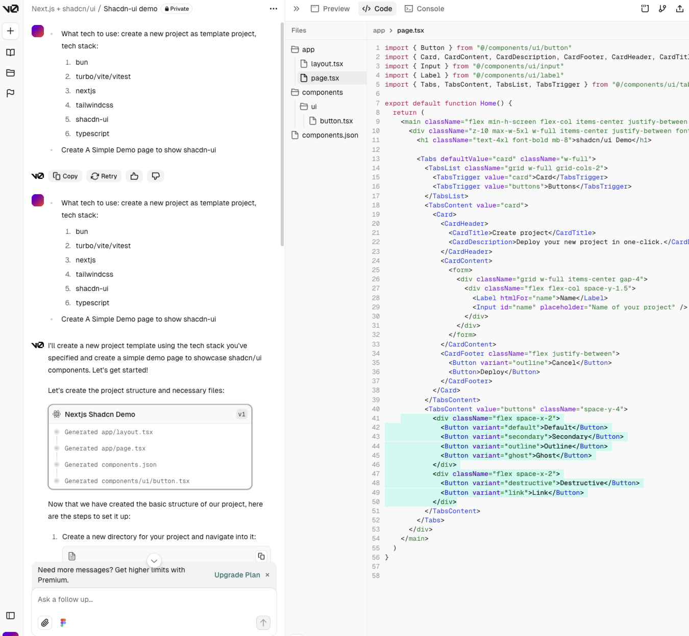
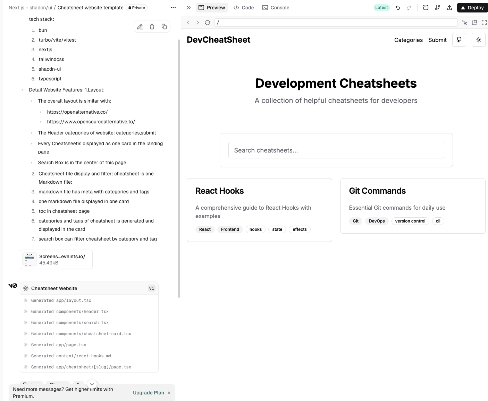
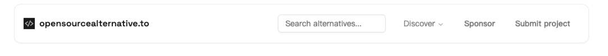

# How to build a Cheatsheet Website without sound frontend skills

How to build a Cheatsheet Website without sound frontend skills?
Let's have AI tools to help.

Tools used:
1. [v0.dev](https://v0.dev/)
2. [cursor] cursor editor
3. [winsurf] editor

## Create An Demo Project as project template

- What tech to use: create a new project as template project, tech stack:
  1. bun
  2. turbo/vite/vitest
  3. nextjs
  4. tailwindcss
  5. shacdn-ui
  6. typescript
- Create A Simple Demo page to show shacdn-ui



## Start from prompts

- what to build?
- what tech stack to use?
- what reference website?

## Prompts:

- What to build:
  I want to build cheatsheet webiste like:https://devhints.io/
- What tech to use: create a new project as template project, tech stack:
  1. bun
  2. turbo/vite/vitest
  3. nextjs
  4. tailwindcss
  5. shacdn-ui
  6. typescript
- Detail Website Features:
  1.Layout:
  - The overall layout is similar with:
    * https://openalternative.co/
    * https://www.opensourcealternative.to/
  - The Header categories of website: categories,submit
  - Every Cheatsheetis displayed as one card in the landing page
  - Search Box is in the center of this page

  2. Cheatsheet file display and filter:
    cheatsheet is one Markdown file:
    1. markdown file has meta with categories and tags
    2. one markdown file displayed in one card
    3. toc in cheatsheet page
    4. categories and tags of cheatsheet is generated and displayed in the card
    5. search box can filter cheatsheet by category and tag


## Featues

1. Add Toc and client mode for markdown files
```sh
1. There is toc in markdown page
2. If there are a lot of markdown file, how to use client mode to retrieve these
3. How to filter it with categories and tags of markdown files

Please fix these issues

```
2. Refine layout


## Build Header

